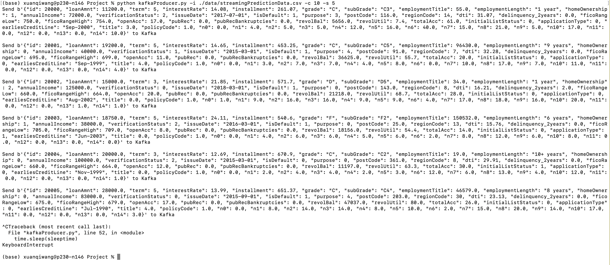

# ID2221 Data-Intensive Computing Task 4 - Project Report
### Group2: Siwei Zhang (siweizh@kth.se), Xuanqi Wang (xuanqi@kth.se), Yudong Wang (yudongwa@kth.se).

This report consists of two parts. 
The first part summarizes what we did in project and the second part gives the instructions on how to run our codes. 

## Part 1: Streaming Default Prediction System with Spark
This part covers the background and dataset, what we have done, and our results. 

### **1. The Background and Dataset**

Credit risk refers to the risk that a contracted payment will not be made. In simple words, it is the risk
of borrower not repaying loan, credit card or any other type of loan. From the bank’s perspective, it is
important to recognise the credit risk. One major part of the credit risk is the Probability of Default (PD).
PD means the likelihood that a borrower will default on debt.

In this project, we built a real-time analyzer for predicting whether the loan applicant is likely
to default based on the data information of the loan applicant. 

The dataset we used is [One Tianchi Competition Dataset](https://tianchi.aliyun.com/competition/entrance/531830/introduction?spm=5176.12281973.0.0.68893eafA7DnJU&lang=en-us).
The dataset comes from the loan
records of a credit platform, with a total data volume of 0.8 million, including 47 columns of
variable information, of which 15 are anonymous variables.

The dataframe schema in the dataset is given as follows.
```
['id', 'loanAmnt', 'term', 'interestRate', 'installment', 'grade',
'subGrade', 'employmentTitle', 'employmentLength', 'homeOwnership',
'annualIncome', 'verificationStatus', 'issueDate', 'isDefault',
'purpose', 'postCode', 'regionCode', 'dti', 'delinquency_2years',
'ficoRangeLow', 'ficoRangeHigh', 'openAcc', 'pubRec',
'pubRecBankruptcies', 'revolBal', 'revolUtil', 'totalAcc',
'initialListStatus', 'applicationType', 'earliesCreditLine', 'title',
'policyCode', 'n0', 'n1', 'n2', 'n3', 'n4', 'n5', 'n6', 'n7', 'n8',
'n9', 'n10', 'n11', 'n12', 'n13', 'n14']
```
Each feature has own connotations. Since this is not our focus, in the following context, we will explain some of them if necessay. 

### **2. Detailed Design and Implementation**

We designed and implemented a streaming default prediction system based on PySpark and Kafka. 

The whole system architecture is given in Figure 1:
 
* Figure 1: The  system architecture.

The system has four components:  **`Kafka Server`**,  **`Kafka Producer`**, **`Batch Training Application`**, and **`Streaming Predictor`**. 

#### **Data Proprocessing**

The whole dataset is 0.8 million, whose `id` is one identifier from 1 to 800,000.

We extracted the first 20000 (id is from 1 to 20000) as `BatchTrainingData.csv`, which was used to train the Linear Regression Model in `Batch Training Application`.

We extracted the next 20000 (id is from 20000 to 40000) as `streamingPredictionData.csv`, which was read by Kafka Producer in chunk and was sent to Kafka Server for simulating the streaming data.

#### **Kafka Server**

The `Kafka Server` is one dockerized kafka instance, which we tailored [this](https://version.aalto.fi/gitlab/bigdataplatforms/cs-e4640/-/blob/master/tutorials/basickafka/docker-compose1.yml) for our purpose.
We mapped the localhost port to the port in the container so that `Kafka Producer` and `Streaming Predictor` can still run normally for localhost Kafka server if docker is not installed. 

#### **Batch Training**

The `Batch Training` used the `BathTrainingData.csv` to train a linear regression model and saved the model.

In this file, we only used the following features to train the model.  
```
["id","loanAmnt", "term", "interestRate", "installment", "homeOwnership",
       "annualIncome", "verificationStatus", "dti", "delinquency_2years",
       "ficoRangeLow", "ficoRangeHigh", "openAcc", "pubRec", "revolBal", "totalAcc","isDefault", "grade"]
```
The `id` is one identifier and was not used to train. 
The `isDefault` is the real binary classification label.

The following features are numerical data:
```angular2html
["id","loanAmnt", "term", "interestRate", "installment", "homeOwnership",
       "annualIncome", "verificationStatus", "dti", "delinquency_2years",
       "ficoRangeLow", "ficoRangeHigh", "openAcc", "pubRec", "revolBal", "totalAcc"]
```
Only the feature `dti` has missing values and we used `pyspark.ml.feature.Imputer` to fill missing values. 
After filling missing values, we first used `pyspark.ml.feature.VectorAssembler` to aggegate these numerical features into one vector and used `pyspark.ml.feature.StandardScaler` to standardize this vector.  

Only the feature `grade` is the categorial data and we used `pyspark.ml.feature.StringIndexer` and `pyspark.ml.feature.OneHotEncoder` consecutively to map this column to numerical binary vector. 

Then, we use `pyspark.ml.feature.VectorAssembler` to combine numerical and categorial features into one vector and added `pyspark.ml.classification.LogisticRegression` to get the model. 

The whole pipeline was: 
```angular2html
pipeline = Pipeline(stages=[imputer, indexer, onehoter, num_features_assembler, scaler, scaled_cate_assembler,lr])
```

#### **Kafka Producer**
The `Kafka Producer` read the small chunk data from the whole data and sent it (JSON) into Kafka to simulate the streaming data.

#### **Streaming Predictor**
The `Streaming Predictor` received data from `Kafka Producer` and used the model generated by `Batch Training Application` to predict the real-time default probability and output the results to the console. 


### **3. Our Results**

Firstly, we run the `batchTraining Application` process and got the results in Figure 2: 

 
* Figure 2: The `batchTraining` running results.

As we can see, our model accuracy reached to 80 percent and the AUC was 0.70. 
Therefore, the model can be used to achieve streaming prediction. 

After we started Kafka instance, we started `Kafka Producer` process and `Streaming Predictor` process. 
The `Kafka Producer` running results are given in Figure 3. 

 
* Figure 3: The `Kafka Producer` running results.

In Figure 3, the `-c 10` means the chunksize is 10 when this process read the original data, i.e., `StreamingPredictionData.csv`. 
In this scenario, the process read the 10 lines at one time.

The `-s 5` means the process read the data every five seconds.
In this way, the producer send one line(one user) every five second so that we can read the results of `Streaming Predictor` more clearly. 

The `Streaming Predictor` running results are given in Figure 4-6. 

 
* Figure 4: The first part `Streaming Predictor` running results.

In Figure 4, we started the process using 
>spark-submit --packages org.apache.spark:spark-sql-kafka-0-10_2.12:3.3.0 streamingPredictor.py.


 
* Figure 5: The second part `Streaming Predictor` running results.

In Figure 5 above, we showed the schema of received data and data after feature filtering. 

 
* Figure 6: The second part `Streaming Predictor` running results.

In Figure 6, the micro batch 0 has no results since the process was waiting for data. 
Then, in micro batch 1, the data whose `id` is 20000 arrived and the predictor get the probability and prediction in the final two column. 
In the following micro batches, the data whose `id` was from 20001 to 20005 arrived and got their prediction results. 

## Part 2: Deployment
We deploy the following components step by step: 

1. **`Batch Training Application`**,
2. **`Kafka Server`**,
3. **`Streaming Predictor`**, 
4. **`Kafka Producer`**.

You may need root access to install components and run docker. All the docker images are by default pulled from `docker-hub`.

#### 1. `Batch Training Application`:
Run the following command: 
> python batchTraining.py

#### 2. `Kafka Server`:
Run the following command:
> docker-compose up -d

To stop the Kafka instance, use the following to exit.
> docker-compose stop

#### 3. `Streaming Predictor`:
1. run the following command.
    > spark-submit --packages org.apache.spark:spark-sql-kafka-0-10_2.12:3.3.0 streamingPredictor.py

#### 4. **`Kafka Producer`**: 

To clearly show the predict results, run the following command: 
> python kafkaProducer.py -i ./data/streamingPredictionData.csv -c 10 -s 5

To simulate real-time streaming data, run the following command: 
> python kafkaProducer.py -i ./data/streamingPredictionData.csv -c 10 -s 0